# FairArena Database Design Document

> **Version:** 1.0.0
> **Database:** PostgreSQL 15+
> **ORM:** Prisma 6.x
> **Last Updated:** 2025-12-30

---

## Table of Contents

1. [Overview](#overview)
2. [Entity Relationship Diagram](#entity-relationship-diagram)
3. [Core Entities](#core-entities)
4. [Organization Hierarchy](#organization-hierarchy)
5. [Payment & Credits System](#payment--credits-system)
6. [Notification System](#notification-system)
7. [Audit & Logging](#audit--logging)
8. [Indexing Strategy](#indexing-strategy)
9. [Query Patterns](#query-patterns)
10. [Data Retention Policies](#data-retention-policies)

---

## Overview

### Database Topology


### Schema Summary

| Category        | Tables | Primary Purpose                        |
| --------------- | ------ | -------------------------------------- |
| User Management | 4      | User identity, profiles, settings      |
| Organizations   | 8      | Org structure, roles, permissions      |
| Teams           | 7      | Team structure, roles, invites         |
| Projects        | 6      | Project structure, roles               |
| Payments        | 4      | Transactions, webhooks, plans          |
| Engagement      | 5      | Stars, follows, views, reports         |
| System          | 4      | Notifications, settings, logs, support |

---

## Entity Relationship Diagram

### Complete Database Schema


---

## Core Entities

### User

The central identity entity linking all user data.

```prisma
model User {
  id                    String                  @id @default(cuid())
  userId                String                  @unique  // Clerk user ID
  email                 String                  @unique
  createdAt             DateTime                @default(now())
  updatedAt             DateTime                @updatedAt
  deletedAt             DateTime?               // Soft delete timestamp
  isDeleted             Boolean                 @default(false)
  firstName             String?
  lastName              String?
  profileImageUrl       String?
  username              String?
  phoneNumber           String?                 @unique
  isPhoneVerified       Boolean                 @default(false)
  hasClaimedFreeCredits Boolean                 @default(false)

  // Relations
  creditTransactions    CreditTransaction[]
  Logs                  Logs[]
  notifications         Notification[]
  organizationFollowers OrganizationFollowers[]
  organizationStars     OrganizationStars[]
  OrganizationUserRole  OrganizationUserRole[]
  payments              Payment[]
  profile               Profile?
  profileStars          ProfileStars[]
  projectUserRoles      ProjectUserRole[]
  reports               Report[]
  settings              Settings?
  supportRequests       Support[]
  teamUserRoles         TeamUserRole[]
  userOrganizations     UserOrganization[]
  projectMemberships    UserProject[]
  teamMemberships       UserTeam[]

  @@index([userId])
  @@index([email])
  @@index([phoneNumber])
  @@index([isPhoneVerified])
  @@index([hasClaimedFreeCredits])
  @@index([isDeleted])
  @@index([userId, isPhoneVerified])
  @@index([userId, hasClaimedFreeCredits])
  @@index([phoneNumber, isPhoneVerified])
}
```

**Key Design Decisions:**

1. **`userId` vs `id`**: `userId` is Clerk's ID, `id` is internal CUID
2. **Soft Delete**: `isDeleted` flag + `deletedAt` for GDPR compliance
3. **Phone Verification**: Required for free credits claim
4. **Comprehensive Indexes**: Optimized for common query patterns

### Profile

Extended user profile information for public visibility.

```prisma
model Profile {
  id                String         @id @default(cuid())
  userId            String         @unique
  bio               String         @db.VarChar(500)
  createdAt         DateTime       @default(now())
  updatedAt         DateTime       @updatedAt
  company           String?
  dateOfBirth       DateTime?
  education         String[]       // Array of education entries
  gender            gender?
  githubUsername    String?
  interests         String[]
  isPublic          Boolean        @default(false)
  jobTitle          String?
  languages         String[]
  linkedInProfile   String?
  location          String?
  phoneNumber       String?
  portfolioUrl      String?
  requireAuth       Boolean        @default(false)
  resumeUrl         String?
  skills            String[]
  trackViews        Boolean        @default(false)
  twitterHandle     String?
  yearsOfExperience Int?
  awards            String[]
  certifications    String[]
  experiences       String[]
  firstName         String?
  lastName          String?

  user              User           @relation(fields: [userId], references: [userId], onDelete: Cascade)
  profileStars      ProfileStars[]
  profileViews      ProfileView[]

  @@index([userId])
  @@index([isPublic])
  @@index([requireAuth])
  @@index([trackViews])
}
```

### Settings

JSON-based user settings for flexibility.

```prisma
model Settings {
  id        String   @id @default(cuid())
  settings  Json     // Flexible settings object
  userId    String   @unique
  createdAt DateTime @default(now())
  updatedAt DateTime @updatedAt

  user      User     @relation(fields: [userId], references: [userId], onDelete: Cascade)

  @@index([userId])
}
```

**Settings JSON Structure:**

```json
{
  "theme": "dark",
  "language": "en",
  "timezone": "UTC",
  "notifications": {
    "email": true,
    "push": true,
    "marketing": false
  },
  "privacy": {
    "showEmail": false,
    "showPhone": false,
    "allowMessages": true
  },
  "accessibility": {
    "reducedMotion": false,
    "highContrast": false
  }
}
```

---

## Organization Hierarchy

### Organization Structure


### Organization Entity

```prisma
model Organization {
  id                    String                   @id @default(cuid())
  name                  String                   @unique
  slug                  String                   @unique
  joinEnabled           Boolean                  @default(false)
  isPublic              Boolean                  @default(true)
  isDeleted             Boolean                  @default(false)
  deletedAt             DateTime?
  timezone              String?
  createdAt             DateTime                 @default(now())
  updatedAt             DateTime                 @updatedAt

  organizationAuditLogs OrganizationAuditLog[]
  organizationFollowers OrganizationFollowers[]
  inviteCodes           OrganizationInviteCode[]
  organizationProfile   OrganizationProfile?
  organizationRoles     OrganizationRole[]
  organizationStars     OrganizationStars[]
  organizationUserRoles OrganizationUserRole[]
  teams                 Team[]
  userOrganizations     UserOrganization[]

  @@index([name])
  @@index([slug])
  @@index([isPublic])
  @@index([joinEnabled])
  @@index([createdAt])
}
```

### Role-Based Access Control

```prisma
model OrganizationRole {
  id                      String                   @id @default(cuid())
  organizationId          String
  roleName                String
  permissions             Json                     // Permission flags
  createdAt               DateTime                 @default(now())
  updatedAt               DateTime                 @updatedAt

  organizationInviteCodes OrganizationInviteCode[]
  organization            Organization             @relation(...)
  organizationUserRoles   OrganizationUserRole[]

  @@unique([organizationId, roleName])
  @@index([organizationId])
  @@index([roleName])
}

model OrganizationUserRole {
  id             String           @id @default(cuid())
  userId         String
  organizationId String
  roleId         String
  assignedAt     DateTime         @default(now())

  organization   Organization     @relation(...)
  role           OrganizationRole @relation(...)
  user           User             @relation(...)

  @@unique([userId, organizationId, roleId])
  @@index([userId])
  @@index([organizationId])
  @@index([roleId])
  @@index([organizationId, userId])
}
```

**Default Permissions JSON:**

```json
{
  "org:read": true,
  "org:update": false,
  "org:delete": false,
  "org:settings:manage": false,
  "org:members:read": true,
  "org:members:invite": false,
  "org:members:remove": false,
  "org:roles:manage": false,
  "org:teams:create": false,
  "org:teams:delete": false,
  "org:audit:read": false
}
```

### Team & Project (Similar Pattern)

Teams and Projects follow the same role-based pattern with their own Role, UserRole, Profile, InviteCode, and AuditLog tables.

---

## Payment & Credits System

### Payment Flow Schema

```mermaid
%%{init: {'theme': 'base'}}%%
flowchart LR
    subgraph PLAN["Plan Selection"]
        PL["Plan<br/>{id, amount, credits}"]
    end

    subgraph PAYMENT["Payment Process"]
        PA["Payment<br/>PENDING → COMPLETED"]
        WE["PaymentWebhookEvent"]
    end

    subgraph CREDITS["Credit System"]
        CT["CreditTransaction<br/>{amount, balance, type}"]
    end

    PL --> PA
    PA --> WE
    PA --> CT
```



### Plan

Defines available credit packages.

```prisma
model Plan {
  id          String    @id @default(cuid())
  name        String    @unique
  planId      String    @unique    // External identifier
  amount      Int                   // Price in smallest currency unit
  currency    String    @default("INR")
  credits     Int                   // Credits awarded
  description String?
  features    String[]             // Feature list
  isActive    Boolean   @default(true)
  createdAt   DateTime  @default(now())
  updatedAt   DateTime  @updatedAt

  payments    Payment[]

  @@index([planId])
  @@index([isActive])
  @@index([name])
}
```

### Payment

Tracks payment lifecycle.

```prisma
model Payment {
  id                 String                @id @default(cuid())
  userId             String
  razorpayOrderId    String                @unique
  razorpayPaymentId  String?               @unique
  razorpaySignature  String?
  planId             String
  planName           String
  amount             Int
  currency           String                @default("INR")
  credits            Int
  status             PaymentStatus         @default(PENDING)
  paymentMethod      String?
  paymentContact     String?
  receipt            String?
  notes              Json?
  ipAddress          String?
  userAgent          String?
  idempotencyKey     String?               @unique
  webhookProcessed   Boolean               @default(false)
  webhookProcessedAt DateTime?
  failureReason      String?
  refundId           String?               @unique
  refundAmount       Int?
  refundReason       String?
  refundedAt         DateTime?
  createdAt          DateTime              @default(now())
  completedAt        DateTime?
  invoiceUrl         String?
  razorpayInvoiceId  String?               @unique

  creditTransactions CreditTransaction[]
  plan               Plan                  @relation(...)
  user               User                  @relation(...)
  webhookEvents      PaymentWebhookEvent[]

  @@index([userId])
  @@index([razorpayOrderId])
  @@index([razorpayPaymentId])
  @@index([status])
  @@index([createdAt])
  @@index([userId, status])
  @@index([userId, createdAt])
  @@index([idempotencyKey])
  @@index([webhookProcessed])
  @@index([refundId])
  @@index([planId])
}

enum PaymentStatus {
  PENDING
  PROCESSING
  COMPLETED
  FAILED
  CANCELLED
  REFUNDED
  PARTIALLY_REFUNDED
}
```

### Credit Transaction

Event-sourced credit balance tracking.

```prisma
model CreditTransaction {
  id          String                @id @default(cuid())
  userId      String
  paymentId   String?               @unique
  amount      Int                   // Positive or negative
  balance     Int                   // Running balance after transaction
  type        CreditTransactionType
  description String
  metadata    Json?
  createdAt   DateTime              @default(now())

  payment     Payment?              @relation(...)
  user        User                  @relation(...)

  @@index([userId])
  @@index([paymentId])
  @@index([type])
  @@index([createdAt])
  @@index([userId, createdAt])
  @@index([userId, type])
  @@index([userId, type, createdAt])
}

enum CreditTransactionType {
  PURCHASE
  REFUND
  BONUS
  DEDUCTION
  ADJUSTMENT
  INITIAL_ALLOCATION
  EXPIRY
  TRANSFER_IN
  TRANSFER_OUT
}
```

**Balance Calculation Pattern:**

```sql
-- Get current balance
SELECT balance FROM CreditTransaction
WHERE userId = 'user_xyz'
ORDER BY createdAt DESC
LIMIT 1;

-- Create new transaction with running balance
INSERT INTO CreditTransaction (userId, amount, balance, type, description)
SELECT
  'user_xyz',
  100,  -- credits to add
  COALESCE((
    SELECT balance FROM CreditTransaction
    WHERE userId = 'user_xyz'
    ORDER BY createdAt DESC
    LIMIT 1
  ), 0) + 100,
  'PURCHASE',
  'Pro Plan purchase';
```

---

## Notification System

### Notification Entity

```prisma
model Notification {
  id          String           @id @default(cuid())
  userId      String
  type        NotificationType
  title       String
  message     String
  description String
  read        Boolean          @default(false)
  actionUrl   String?
  actionLabel String?
  metadata    Json?
  createdAt   DateTime         @default(now())
  readAt      DateTime?

  user        User             @relation(...)

  @@index([userId])
  @@index([read])
  @@index([type])
  @@index([createdAt])
  @@index([userId, read])
  @@index([userId, createdAt])
}

enum NotificationType {
  SYSTEM
  MENTION
  INVITATION
  ACHIEVEMENT
  UPDATE
  REMINDER
  ALERT
  MESSAGE
  FOLLOW
  STAR
  COMMENT
  ANNOUNCEMENT
}
```

### Common Notification Queries

```sql
-- Get unread count
SELECT COUNT(*) FROM Notification
WHERE userId = 'user_xyz' AND read = false;

-- Get recent notifications
SELECT * FROM Notification
WHERE userId = 'user_xyz'
ORDER BY createdAt DESC
LIMIT 20;

-- Mark all as read
UPDATE Notification
SET read = true, readAt = NOW()
WHERE userId = 'user_xyz' AND read = false;
```

---

## Audit & Logging

### Audit Log Schema


### Log Level Enum

```prisma
enum level {
  INFO
  WARN
  CRITICAL
}
```

### Common Actions

| Context | Action              | Level | Description            |
| ------- | ------------------- | ----- | ---------------------- |
| User    | `profile.updated`   | INFO  | Profile fields changed |
| User    | `settings.changed`  | INFO  | Settings modified      |
| User    | `password.changed`  | WARN  | Password updated       |
| Org     | `member.invited`    | INFO  | New member invited     |
| Org     | `member.removed`    | WARN  | Member removed         |
| Org     | `role.created`      | INFO  | New role defined       |
| Org     | `settings.changed`  | INFO  | Org settings modified  |
| Team    | `project.created`   | INFO  | New project added      |
| Team    | `member.joined`     | INFO  | Member accepted invite |
| Payment | `payment.completed` | INFO  | Successful payment     |
| Payment | `payment.failed`    | WARN  | Payment failure        |
| Payment | `refund.initiated`  | WARN  | Refund started         |

---

## Indexing Strategy

### Primary Indexes

| Table        | Index                    | Type   | Purpose                   |
| ------------ | ------------------------ | ------ | ------------------------- |
| User         | `userId`                 | Unique | Primary lookup from Clerk |
| User         | `email`                  | Unique | Email-based lookup        |
| Payment      | `razorpayOrderId`        | Unique | Webhook processing        |
| Payment      | `razorpayPaymentId`      | Unique | Payment verification      |
| Organization | `slug`                   | Unique | URL-based lookup          |
| Team         | `[organizationId, slug]` | Unique | Scoped URL lookup         |

### Composite Indexes

| Table                | Index                   | Columns                 | Query Pattern     |
| -------------------- | ----------------------- | ----------------------- | ----------------- |
| CreditTransaction    | `idx_user_type_created` | userId, type, createdAt | Filtered history  |
| Notification         | `idx_user_read`         | userId, read            | Unread count      |
| OrganizationUserRole | `idx_org_user`          | organizationId, userId  | Permission check  |
| Payment              | `idx_user_status`       | userId, status          | User payment list |

### Partial Indexes (Recommended Additions)

```sql
-- Index only active organizations
CREATE INDEX idx_active_orgs ON "Organization" (name)
WHERE "isDeleted" = false;

-- Index only unread notifications
CREATE INDEX idx_unread_notifs ON "Notification" (userId, createdAt)
WHERE read = false;

-- Index pending payments
CREATE INDEX idx_pending_payments ON "Payment" (createdAt)
WHERE status = 'PENDING';
```

---

## Query Patterns

### User Credit Balance

```typescript
// Get current balance from last transaction
async function getUserCreditBalance(userId: string): Promise<number> {
  const lastTransaction = await prisma.creditTransaction.findFirst({
    where: { userId },
    orderBy: { createdAt: 'desc' },
    select: { balance: true },
  });
  return lastTransaction?.balance || 0;
}
```

### Organization Permission Check

```typescript
async function checkOrgPermission(
  userId: string,
  orgId: string,
  permission: string,
): Promise<boolean> {
  const role = await prisma.organizationUserRole.findFirst({
    where: {
      userId,
      organizationId: orgId,
    },
    include: { role: true },
  });

  if (!role) return false;

  const permissions = role.role.permissions as Record<string, boolean>;
  return permissions[permission] === true;
}
```

### Paginated Notifications

```typescript
async function getNotifications(userId: string, { limit = 20, offset = 0, read }: QueryParams) {
  const where = { userId, ...(read !== undefined && { read }) };

  const [notifications, total] = await Promise.all([
    prisma.notification.findMany({
      where,
      orderBy: { createdAt: 'desc' },
      take: limit,
      skip: offset,
    }),
    prisma.notification.count({ where }),
  ]);

  return { notifications, total, limit, offset };
}
```

### Payment with Webhook Events

```typescript
async function getPaymentWithEvents(paymentId: string) {
  return prisma.payment.findUnique({
    where: { id: paymentId },
    include: {
      plan: true,
      user: {
        select: { email: true, firstName: true, lastName: true },
      },
      webhookEvents: {
        orderBy: { createdAt: 'desc' },
        take: 10,
      },
      creditTransactions: true,
    },
  });
}
```

---

## Data Retention Policies

### Retention Schedule

| Data Type       | Retention                | Action                  | Legal Basis     |
| --------------- | ------------------------ | ----------------------- | --------------- |
| User Account    | Indefinite (soft delete) | Anonymize after 30 days | GDPR compliance |
| Profile         | With user                | Cascade delete          | User data       |
| Notifications   | 90 days                  | Hard delete             | System data     |
| Audit Logs      | 365 days                 | Archive then delete     | Compliance      |
| Payment Records | 7 years                  | Archive                 | Tax regulations |
| Webhook Events  | 90 days                  | Hard delete             | System data     |
| Invite Codes    | Until used or 30 days    | Hard delete             | Temporary       |
| OTP Data        | 5 minutes                | Auto-expire (Redis)     | Security        |

### Cleanup Jobs

```typescript
// Daily cleanup job
const dailyCleanup = inngest.createFunction(
  { id: 'cleanup/daily', cron: '0 3 * * *' },
  async () => {
    // Delete expired invites
    await prisma.organizationInviteCode.deleteMany({
      where: {
        expiresAt: { lt: new Date() },
        used: false,
      },
    });

    // Delete old notifications
    const ninetyDaysAgo = new Date();
    ninetyDaysAgo.setDate(ninetyDaysAgo.getDate() - 90);

    await prisma.notification.deleteMany({
      where: { createdAt: { lt: ninetyDaysAgo } },
    });

    // Anonymize soft-deleted users > 30 days
    const thirtyDaysAgo = new Date();
    thirtyDaysAgo.setDate(thirtyDaysAgo.getDate() - 30);

    await prisma.user.updateMany({
      where: {
        isDeleted: true,
        deletedAt: { lt: thirtyDaysAgo },
        email: { not: { startsWith: 'deleted_' } },
      },
      data: {
        email: prisma.raw('CONCAT("deleted_", id, "@anonymized.local")'),
        firstName: null,
        lastName: null,
        phoneNumber: null,
      },
    });
  },
);
```

---

## Migration Commands

```bash
# Generate Prisma client
npx prisma generate

# Create migration
npx prisma migrate dev --name <migration_name>

# Apply migrations (production)
npx prisma migrate deploy

# Reset database (development only!)
npx prisma migrate reset

# View database
npx prisma studio
```

---

_This document provides comprehensive database design documentation for the FairArena platform._
