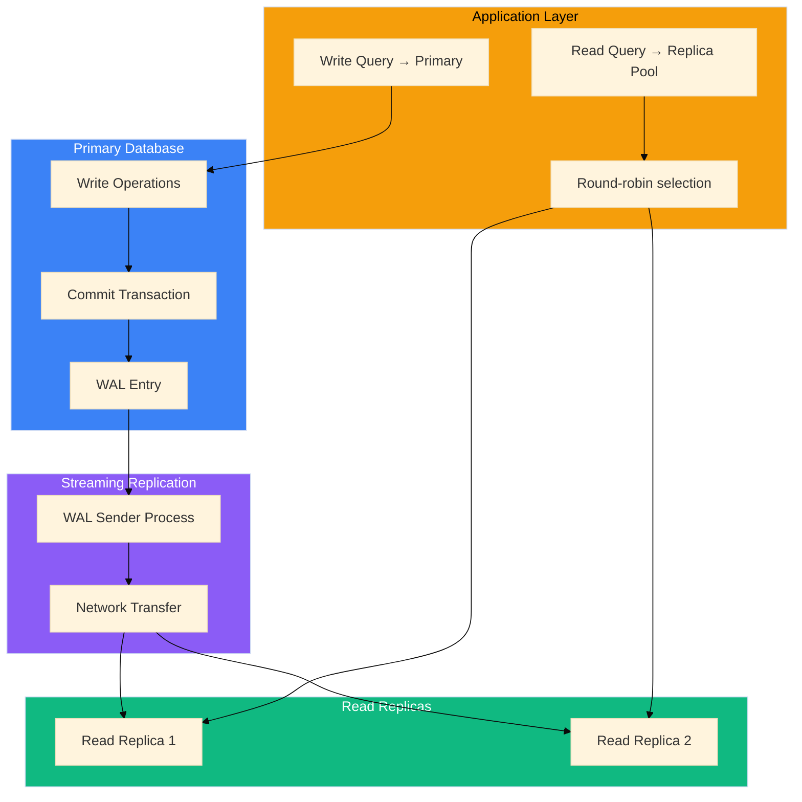

# FairArena Data Flow Documentation

> **Version:** 1.0.0
> **Last Updated:** 2025-12-30
> **Status:** Production Ready

---

## Table of Contents

1. [Request Lifecycle](#request-lifecycle)
2. [User Workflows](#user-workflows)
3. [Organization Workflows](#organization-workflows)
4. [Payment Workflows](#payment-workflows)
5. [Notification Workflows](#notification-workflows)
6. [Background Job Flows](#background-job-flows)
7. [Data Synchronization](#data-synchronization)

---

## Request Lifecycle

### HTTP Request Flow


### Request Context Propagation


---

## User Workflows

### User Registration Flow


### User Login Flow


### Profile Update Flow


### Profile View Tracking


---

## Organization Workflows

### Organization Creation Flow


### Organization Member Invitation Flow


### Organization Permission Check


---

## Payment Workflows

### Complete Payment Flow


### Payment Data Flow Detail


### Credit Transaction Balance Calculation


---

## Notification Workflows

### Notification Creation Flow


### Notification State Transitions


### Batch Notification Operations


---

## Background Job Flows

### Daily Cleanup Job


### Weekly Feedback Email Job


### User Data Export Job


---

## Data Synchronization

### Clerk User Sync


### Read Replica Synchronization



### Cache Consistency Model

```mermaid
%%{init: {'theme': 'base'}}%%
flowchart TB
    subgraph STRATEGY["Cache-Aside Strategy"]
        S1["Read: Check cache first"]
        S2["Miss: Query database"]
        S3["Write result to cache"]
        S4["Write: Update database"]
        S5["Invalidate cache"]
    end

    subgraph PATTERNS["Invalidation Patterns"]
        P1["Direct key deletion"]
        P2["Pattern-based deletion"]
        P3["TTL expiration"]
    end

    subgraph EXAMPLE["Example: Credit Balance"]
        E1["Read: GET user:credits:abc"]
        E2["Miss: SELECT balance FROM CreditTransaction"]
        E3["Cache: SET user:credits:abc = 150 EX 300"]
        E4["Write: INSERT CreditTransaction"]
        E5["Invalidate: DEL user:credits:abc"]
    end

    STRATEGY --> PATTERNS --> EXAMPLE

    style STRATEGY fill:#3b82f6,color:#fff
    style PATTERNS fill:#f59e0b,color:#000
    style EXAMPLE fill:#10b981,color:#fff
```

---

## Appendix: Event Catalog

### All Inngest Events

| Event Name                   | Trigger           | Handler                     | Data Payload                           |
| ---------------------------- | ----------------- | --------------------------- | -------------------------------------- |
| `user/sync`                  | Clerk webhook     | syncUser                    | `{userId, email, firstName, lastName}` |
| `user/update`                | Clerk webhook     | updateUser                  | `{userId, changes}`                    |
| `user/delete`                | Clerk webhook     | deleteUser                  | `{userId}`                             |
| `user/data.export`           | API request       | exportUserDataHandler       | `{userId, format}`                     |
| `profile/update`             | API request       | updateProfileFunction       | `{userId, data}`                       |
| `profile/view.record`        | Profile view      | recordProfileView           | `{profileId, viewerId}`                |
| `profile/star`               | Star action       | starProfile                 | `{profileId, userId}`                  |
| `profile/unstar`             | Unstar action     | unstarProfile               | `{profileId, userId}`                  |
| `payment/order.created`      | Order creation    | paymentOrderCreated         | `{orderId, userId, planId}`            |
| `payment/verified`           | Payment verify    | paymentVerified             | `{paymentId, userId}`                  |
| `payment/webhook.received`   | Razorpay webhook  | paymentWebhookReceived      | `{eventId, eventType, payload}`        |
| `notification/send`          | Various           | sendNotification            | `{userId, type, title, message}`       |
| `notification/mark-read`     | API request       | markNotificationsAsRead     | `{notificationIds}`                    |
| `notification/mark-all-read` | API request       | markAllNotificationsAsRead  | `{userId}`                             |
| `notification/delete`        | API request       | deleteNotifications         | `{notificationIds}`                    |
| `org/invite.send`            | Org invite        | sendOrgInviteEmail          | `{email, orgId, roleId}`               |
| `team/invite.send`           | Team invite       | sendTeamInviteEmail         | `{email, teamId, roleId}`              |
| `team/invite.process`        | Invite processing | processSingleTeamInvite     | `{inviteId}`                           |
| `team/invite.accept`         | Accept invite     | processTeamInviteAcceptance | `{code, userId}`                       |
| `settings/update`            | Settings update   | updateSettingsFunction      | `{userId, settings}`                   |
| `settings/reset`             | Settings reset    | resetSettingsFunction       | `{userId}`                             |
| `support/request.created`    | Support ticket    | supportRequestCreated       | `{ticketId, userId}`                   |
| `feedback/submit`            | Feedback form     | processFeedbackSubmission   | `{code, rating, message}`              |
| `email/send`                 | Email trigger     | sendEmailHandler            | `{to, template, data}`                 |
| `cleanup/daily`              | Cron (3AM)        | dailyCleanup                | `{}`                                   |
| `email/weekly-feedback`      | Cron (Sunday)     | sendWeeklyFeedbackEmail     | `{}`                                   |

---

_This document provides detailed data flow visualizations for all major operations in the FairArena platform._
