# FairArena Backend System Architecture

> **Version:** 1.0.0
> **Last Updated:** 2025-12-30
> **Status:** Production Ready
> **Maintainers:** FairArena Engineering Team

---

## Table of Contents

1. [Executive Summary](#executive-summary)
2. [High-Level Architecture](#high-level-architecture)
3. [System Components](#system-components)
4. [Data Flow Diagrams](#data-flow-diagrams)
5. [Database Schema](#database-schema)
6. [API Gateway & Routing](#api-gateway--routing)
7. [Authentication & Authorization](#authentication--authorization)
8. [Event-Driven Architecture](#event-driven-architecture)
9. [Caching Strategy](#caching-strategy)
10. [Payment Processing](#payment-processing)
11. [AI Integration](#ai-integration)
12. [Observability & Monitoring](#observability--monitoring)
13. [Security Architecture](#security-architecture)
14. [Deployment Architecture](#deployment-architecture)
15. [Disaster Recovery & Failover](#disaster-recovery--failover)
16. [Performance Benchmarks](#performance-benchmarks)

---

## Executive Summary

FairArena is a modern, event-driven web platform built with TypeScript, Express.js, and Prisma ORM. The architecture follows domain-driven design principles with clear separation of concerns across controllers, services, and background workers.

### Key Architectural Decisions

| Decision | Rationale | Trade-offs |
|----------|-----------|------------|
| **Event-Driven (Inngest)** | Decouples synchronous API from async operations | Additional infrastructure complexity |
| **Read Replicas** | Horizontal read scaling, reduced primary DB load | Eventual consistency on reads |
| **Redis Caching** | Sub-millisecond response times for hot data | Cache invalidation complexity |
| **Clerk Authentication** | Enterprise-grade auth without custom implementation | Vendor lock-in |
| **PostgreSQL + Prisma** | Type-safe queries, excellent migration tooling | ORM overhead |

---

## High-Level Architecture

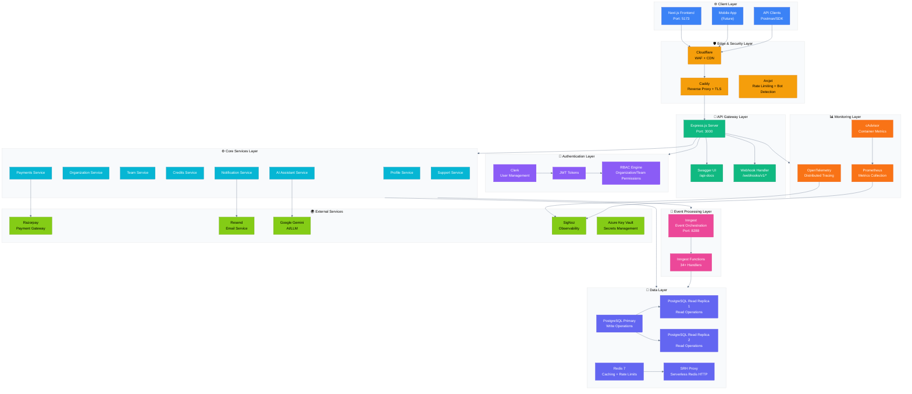
```mermaid
%%{init: {'theme': 'base', 'themeVariables': { 'primaryColor': '#1e3a5f', 'primaryTextColor': '#fff', 'primaryBorderColor': '#2563eb', 'lineColor': '#64748b', 'secondaryColor': '#0ea5e9', 'tertiaryColor': '#f8fafc'}}}%%
flowchart TB
    subgraph CLIENT["🌐 Client Layer"]
        WEB["Next.js Frontend<br/>Port: 5173"]
        MOBILE["Mobile App<br/>(Future)"]
        API_CLIENTS["API Clients<br/>Postman/SDK"]
    end

    subgraph EDGE["🛡️ Edge & Security Layer"]
        CADDY["Caddy<br/>Reverse Proxy + TLS"]
        CF["Cloudflare<br/>WAF + CDN"]
        ARCJET["Arcjet<br/>Rate Limiting + Bot Detection"]
    end

    subgraph GATEWAY["🚪 API Gateway Layer"]
        EXPRESS["Express.js Server<br/>Port: 3000"]
        SWAGGER["Swagger UI<br/>/api-docs"]
        WEBHOOK["Webhook Handler<br/>/webhooks/v1/*"]
    end

    subgraph AUTH["🔐 Authentication Layer"]
        CLERK["Clerk<br/>User Management"]
        JWT["JWT Tokens"]
        RBAC["RBAC Engine<br/>Organization/Team Permissions"]
    end

    subgraph CORE["⚙️ Core Services Layer"]
        PROFILE["Profile Service"]
        ORG["Organization Service"]
        TEAM["Team Service"]
        CREDITS["Credits Service"]
        PAYMENTS["Payments Service"]
        NOTIFY["Notification Service"]
        AI_SVC["AI Assistant Service"]
        SUPPORT["Support Service"]
    end

    subgraph EVENTS["📨 Event Processing Layer"]
        INNGEST["Inngest<br/>Event Orchestration<br/>Port: 8288"]
        FUNCTIONS["Inngest Functions<br/>34+ Handlers"]
    end

    subgraph DATA["💾 Data Layer"]
        PG_PRIMARY["PostgreSQL Primary<br/>Write Operations"]
        PG_READ1["PostgreSQL Read Replica 1<br/>Read Operations"]
        PG_READ2["PostgreSQL Read Replica 2<br/>Read Operations"]
        REDIS["Redis 7<br/>Caching + Rate Limits"]
        SRH["SRH Proxy<br/>Serverless Redis HTTP"]
    end

    subgraph EXTERNAL["🌍 External Services"]
        RAZORPAY["Razorpay<br/>Payment Gateway"]
        RESEND["Resend<br/>Email Service"]
        GEMINI["Google Gemini<br/>AI/LLM"]
        SIGNOZ["SigNoz<br/>Observability"]
        KEYVAULT["Azure Key Vault<br/>Secrets Management"]
    end

    subgraph MONITOR["📊 Monitoring Layer"]
        PROMETHEUS["Prometheus<br/>Metrics Collection"]
        CADVISOR["cAdvisor<br/>Container Metrics"]
        OTEL["OpenTelemetry<br/>Distributed Tracing"]
    end

    WEB & MOBILE & API_CLIENTS --> CF
    CF --> CADDY
    CADDY --> EXPRESS
    EXPRESS --> SWAGGER
    EXPRESS --> WEBHOOK

    EXPRESS --> AUTH
    CLERK --> JWT
    JWT --> RBAC

    EXPRESS --> CORE
    CORE --> EVENTS
    INNGEST --> FUNCTIONS

    CORE --> DATA
    PG_PRIMARY --> PG_READ1
    PG_PRIMARY --> PG_READ2
    FUNCTIONS --> DATA

    PAYMENTS --> RAZORPAY
    NOTIFY --> RESEND
    AI_SVC --> GEMINI

    EXPRESS --> MONITOR
    OTEL --> SIGNOZ
    PROMETHEUS --> SIGNOZ
    CADVISOR --> PROMETHEUS

    REDIS --> SRH

    classDef client fill:#3b82f6,stroke:#1d4ed8,color:#fff
    classDef edge fill:#f59e0b,stroke:#d97706,color:#000
    classDef gateway fill:#10b981,stroke:#059669,color:#fff
    classDef auth fill:#8b5cf6,stroke:#7c3aed,color:#fff
    classDef core fill:#06b6d4,stroke:#0891b2,color:#fff
    classDef events fill:#ec4899,stroke:#db2777,color:#fff
    classDef data fill:#6366f1,stroke:#4f46e5,color:#fff
    classDef external fill:#84cc16,stroke:#65a30d,color:#000
    classDef monitor fill:#f97316,stroke:#ea580c,color:#fff

    class WEB,MOBILE,API_CLIENTS client
    class CADDY,CF,ARCJET edge
    class EXPRESS,SWAGGER,WEBHOOK gateway
    class CLERK,JWT,RBAC auth
    class PROFILE,ORG,TEAM,CREDITS,PAYMENTS,NOTIFY,AI_SVC,SUPPORT core
    class INNGEST,FUNCTIONS events
    class PG_PRIMARY,PG_READ1,PG_READ2,REDIS,SRH data
    class RAZORPAY,RESEND,GEMINI,SIGNOZ,KEYVAULT external
    class PROMETHEUS,CADVISOR,OTEL monitor
```

---

## System Components

### 1. Core Backend Server

| Component | Technology | Port | Purpose |
|-----------|-----------|------|---------|
| API Server | Express.js + TypeScript | 3000 | Main application server |
| Webhook Handler | Express.js | 3000 | /webhooks/* routes for external services |
| Swagger UI | swagger-ui-express | 3000 | API documentation (dev/staging only) |
| Metrics Endpoint | prom-client | 3000 | /metrics for Prometheus scraping |

### 2. Container Services

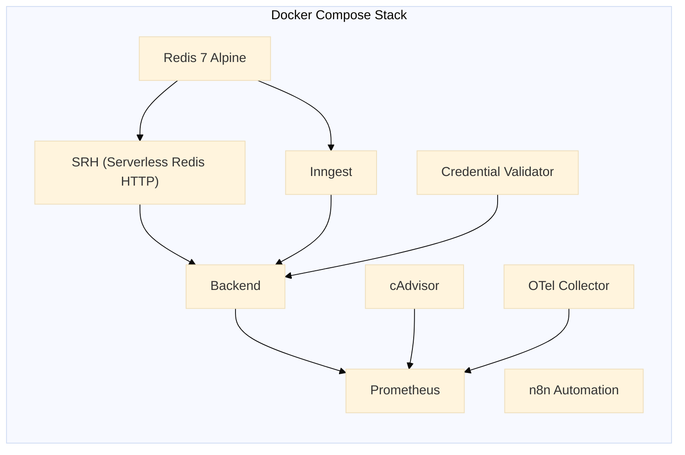
```mermaid
%%{init: {'theme': 'base'}}%%
graph LR
    subgraph DOCKER["Docker Compose Stack"]
        R["Redis 7 Alpine"]
        S["SRH (Serverless Redis HTTP)"]
        I["Inngest"]
        B["Backend"]
        P["Prometheus"]
        C["cAdvisor"]
        O["OTel Collector"]
        CV["Credential Validator"]
        N8N["n8n Automation"]
    end

    R --> S
    S --> B
    R --> I
    I --> B
    B --> P
    C --> P
    O --> P
    CV --> B
```

### 3. Service Registry

| Service | Container Name | Port | Health Check | Dependencies |
|---------|---------------|------|--------------|--------------|
| Redis | Redis | 6379 | `redis-cli ping` | None |
| SRH | SRH | 80 | `curl /redis/ping` | Redis |
| Inngest | Inngest | 8288 | `curl /health` | Redis |
| Backend | Backend | 3000 | `curl /healthz` | SRH |
| Credential Validator | credential-validator | 3002 | `curl /health` | None |
| Prometheus | Prometheus | 9090 | `wget /-/healthy` | Backend |
| cAdvisor | cAdvisor | 8080 | `curl /healthz` | None |
| n8n | n8n | 5678 | `curl /healthz` | None |

---

## Data Flow Diagrams

### User Authentication Flow

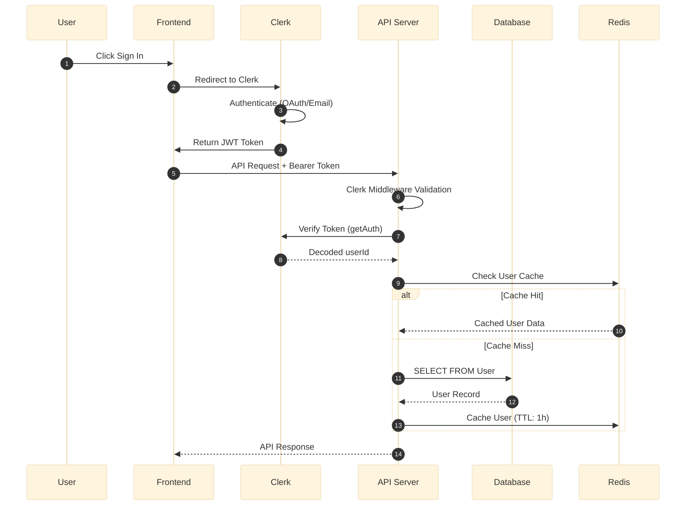
```mermaid
%%{init: {'theme': 'base'}}%%
sequenceDiagram
    autonumber
    participant U as User
    participant F as Frontend
    participant C as Clerk
    participant A as API Server
    participant D as Database
    participant R as Redis

    U->>F: Click Sign In
    F->>C: Redirect to Clerk
    C->>C: Authenticate (OAuth/Email)
    C->>F: Return JWT Token
    F->>A: API Request + Bearer Token
    A->>A: Clerk Middleware Validation
    A->>C: Verify Token (getAuth)
    C-->>A: Decoded userId
    A->>R: Check User Cache
    alt Cache Hit
        R-->>A: Cached User Data
    else Cache Miss
        A->>D: SELECT FROM User
        D-->>A: User Record
        A->>R: Cache User (TTL: 1h)
    end
    A-->>F: API Response
```

### Payment Processing Flow

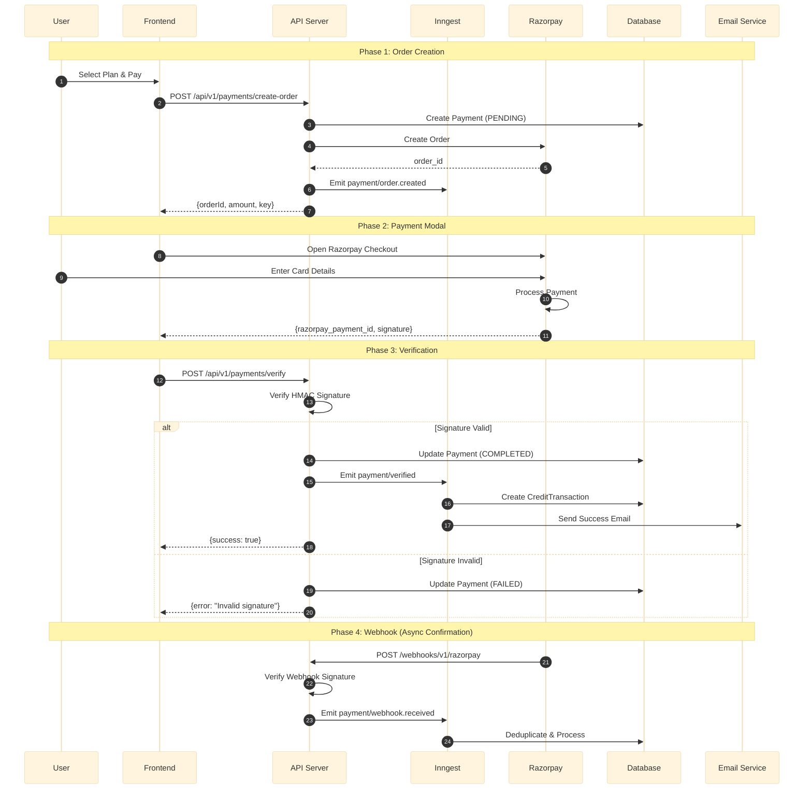
```mermaid
%%{init: {'theme': 'base'}}%%
sequenceDiagram
    autonumber
    participant U as User
    participant F as Frontend
    participant A as API Server
    participant I as Inngest
    participant RP as Razorpay
    participant D as Database
    participant E as Email Service

    Note over U,E: Phase 1: Order Creation
    U->>F: Select Plan & Pay
    F->>A: POST /api/v1/payments/create-order
    A->>D: Create Payment (PENDING)
    A->>RP: Create Order
    RP-->>A: order_id
    A->>I: Emit payment/order.created
    A-->>F: {orderId, amount, key}

    Note over U,E: Phase 2: Payment Modal
    F->>RP: Open Razorpay Checkout
    U->>RP: Enter Card Details
    RP->>RP: Process Payment
    RP-->>F: {razorpay_payment_id, signature}

    Note over U,E: Phase 3: Verification
    F->>A: POST /api/v1/payments/verify
    A->>A: Verify HMAC Signature
    alt Signature Valid
        A->>D: Update Payment (COMPLETED)
        A->>I: Emit payment/verified
        I->>D: Create CreditTransaction
        I->>E: Send Success Email
        A-->>F: {success: true}
    else Signature Invalid
        A->>D: Update Payment (FAILED)
        A-->>F: {error: "Invalid signature"}
    end

    Note over U,E: Phase 4: Webhook (Async Confirmation)
    RP->>A: POST /webhooks/v1/razorpay
    A->>A: Verify Webhook Signature
    A->>I: Emit payment/webhook.received
    I->>D: Deduplicate & Process
```

### Credit System Flow

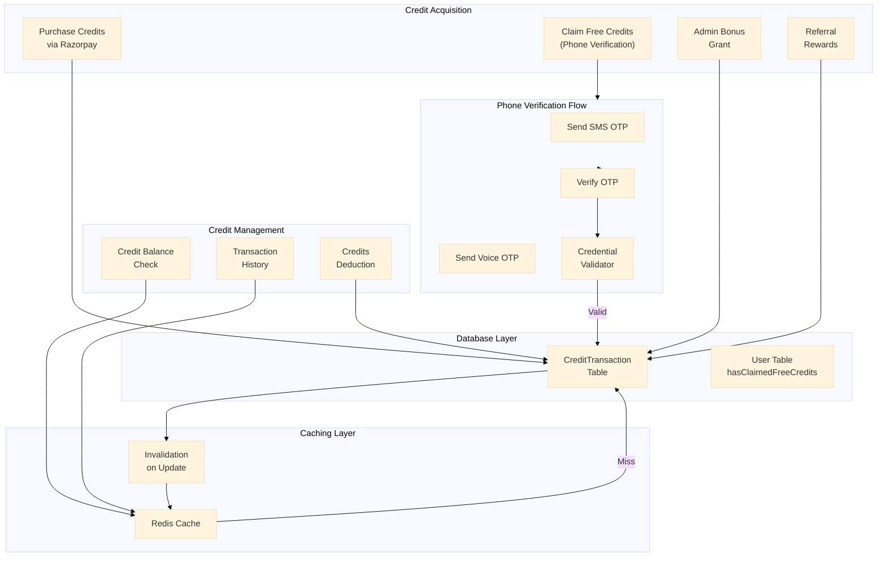
```mermaid
%%{init: {'theme': 'base'}}%%
flowchart TB
    subgraph ACQUISITION["Credit Acquisition"]
        BUY["Purchase Credits<br/>via Razorpay"]
        FREE["Claim Free Credits<br/>(Phone Verification)"]
        BONUS["Admin Bonus<br/>Grant"]
        REF["Referral<br/>Rewards"]
    end

    subgraph FLOW["Credit Management"]
        BAL["Credit Balance<br/>Check"]
        HIST["Transaction<br/>History"]
        DEDUCT["Credits<br/>Deduction"]
    end

    subgraph VERIFY["Phone Verification Flow"]
        SMS["Send SMS OTP"]
        VOICE["Send Voice OTP"]
        CHECK["Verify OTP"]
        CRED["Credential<br/>Validator"]
    end

    subgraph CACHE["Caching Layer"]
        CR["Redis Cache"]
        INV["Invalidation<br/>on Update"]
    end

    subgraph DB["Database Layer"]
        CT["CreditTransaction<br/>Table"]
        USR["User Table<br/>hasClaimedFreeCredits"]
    end

    BUY --> CT
    FREE --> VERIFY
    VERIFY --> CHECK
    CHECK --> CRED
    CRED -->|Valid| CT
    BONUS --> CT
    REF --> CT

    BAL --> CR
    CR -->|Miss| CT
    HIST --> CR

    CT --> INV
    INV --> CR

    DEDUCT --> CT
```

### Organization & Team Hierarchy

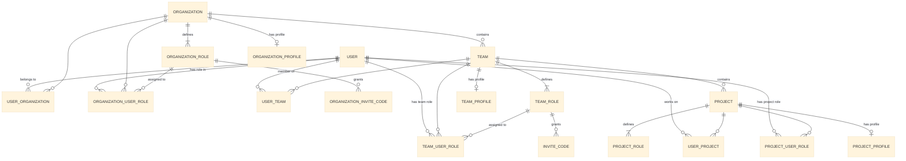
```mermaid
%%{init: {'theme': 'base'}}%%
erDiagram
    USER ||--o{ USER_ORGANIZATION : "belongs to"
    USER ||--o{ ORGANIZATION_USER_ROLE : "has role in"
    USER ||--o{ USER_TEAM : "member of"
    USER ||--o{ TEAM_USER_ROLE : "has team role"
    USER ||--o{ USER_PROJECT : "works on"
    USER ||--o{ PROJECT_USER_ROLE : "has project role"

    ORGANIZATION ||--|{ ORGANIZATION_ROLE : "defines"
    ORGANIZATION ||--o{ TEAM : "contains"
    ORGANIZATION ||--o{ USER_ORGANIZATION : ""
    ORGANIZATION ||--o{ ORGANIZATION_USER_ROLE : ""
    ORGANIZATION ||--o| ORGANIZATION_PROFILE : "has profile"

    ORGANIZATION_ROLE ||--o{ ORGANIZATION_USER_ROLE : "assigned to"
    ORGANIZATION_ROLE ||--o{ ORGANIZATION_INVITE_CODE : "grants"

    TEAM ||--|{ TEAM_ROLE : "defines"
    TEAM ||--o{ PROJECT : "contains"
    TEAM ||--o{ USER_TEAM : ""
    TEAM ||--o{ TEAM_USER_ROLE : ""
    TEAM ||--o| TEAM_PROFILE : "has profile"

    TEAM_ROLE ||--o{ TEAM_USER_ROLE : "assigned to"
    TEAM_ROLE ||--o{ INVITE_CODE : "grants"

    PROJECT ||--|{ PROJECT_ROLE : "defines"
    PROJECT ||--o{ USER_PROJECT : ""
    PROJECT ||--o{ PROJECT_USER_ROLE : ""
    PROJECT ||--o| PROJECT_PROFILE : "has profile"
```

---

## Database Schema

### Core Entities

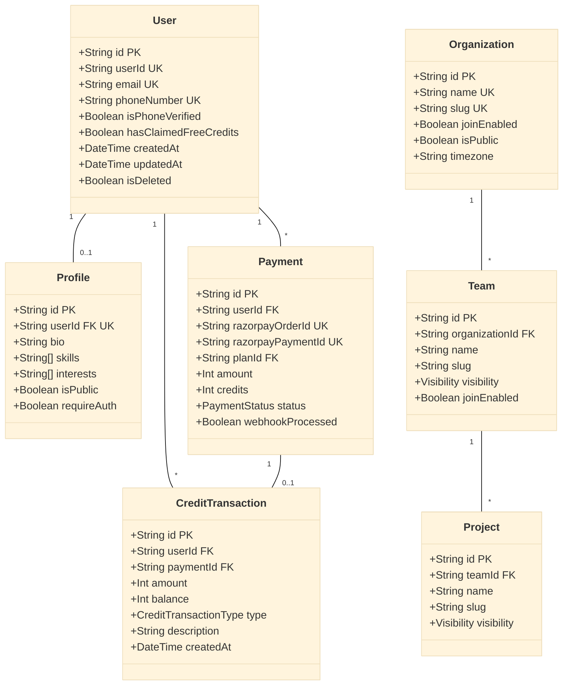
```mermaid
%%{init: {'theme': 'base'}}%%
classDiagram
    class User {
        +String id PK
        +String userId UK
        +String email UK
        +String phoneNumber UK
        +Boolean isPhoneVerified
        +Boolean hasClaimedFreeCredits
        +DateTime createdAt
        +DateTime updatedAt
        +Boolean isDeleted
    }

    class Profile {
        +String id PK
        +String userId FK UK
        +String bio
        +String[] skills
        +String[] interests
        +Boolean isPublic
        +Boolean requireAuth
    }

    class Organization {
        +String id PK
        +String name UK
        +String slug UK
        +Boolean joinEnabled
        +Boolean isPublic
        +String timezone
    }

    class Team {
        +String id PK
        +String organizationId FK
        +String name
        +String slug
        +Visibility visibility
        +Boolean joinEnabled
    }

    class Project {
        +String id PK
        +String teamId FK
        +String name
        +String slug
        +Visibility visibility
    }

    class Payment {
        +String id PK
        +String userId FK
        +String razorpayOrderId UK
        +String razorpayPaymentId UK
        +String planId FK
        +Int amount
        +Int credits
        +PaymentStatus status
        +Boolean webhookProcessed
    }

    class CreditTransaction {
        +String id PK
        +String userId FK
        +String paymentId FK
        +Int amount
        +Int balance
        +CreditTransactionType type
        +String description
        +DateTime createdAt
    }

    User "1" -- "0..1" Profile
    User "1" -- "*" Payment
    User "1" -- "*" CreditTransaction
    Payment "1" -- "0..1" CreditTransaction
    Organization "1" -- "*" Team
    Team "1" -- "*" Project
```

### Enumerations

```typescript
enum PaymentStatus {
  PENDING
  PROCESSING
  COMPLETED
  FAILED
  CANCELLED
  REFUNDED
  PARTIALLY_REFUNDED
}

enum CreditTransactionType {
  PURCHASE
  REFUND
  BONUS
  DEDUCTION
  ADJUSTMENT
  INITIAL_ALLOCATION
  EXPIRY
  TRANSFER_IN
  TRANSFER_OUT
}

enum Visibility {
  PUBLIC
  PRIVATE
  INTERNAL
}

enum NotificationType {
  SYSTEM
  MENTION
  INVITATION
  ACHIEVEMENT
  UPDATE
  REMINDER
  ALERT
  MESSAGE
  FOLLOW
  STAR
  COMMENT
  ANNOUNCEMENT
}

enum ReportState {
  QUEUED
  IN_REVIEW
  RESOLVED
  DISMISSED
  ESCALATED
}

enum ReportSeverity {
  LOW
  MEDIUM
  HIGH
  CRITICAL
}
```

### Database Indexes

| Table | Index | Columns | Purpose |
|-------|-------|---------|---------|
| User | idx_user_userId | userId | Primary lookup |
| User | idx_user_phone | phoneNumber, isPhoneVerified | Phone verification |
| Payment | idx_payment_user_status | userId, status | User payment queries |
| Payment | idx_payment_order | razorpayOrderId | Webhook processing |
| CreditTransaction | idx_credit_user_created | userId, createdAt | Transaction history |
| Notification | idx_notif_user_read | userId, read | Unread count |
| OrganizationUserRole | idx_org_user | organizationId, userId | Permission checks |

---

## API Gateway & Routing

### Route Structure

```
/api/v1
├── /profile
│   ├── GET    /              - Get current user profile
│   ├── PUT    /              - Update profile
│   └── GET    /view/:userId  - View public profile
├── /organization
│   ├── GET    /              - List user organizations
│   ├── POST   /              - Create organization
│   ├── GET    /:orgId        - Get organization details
│   ├── PATCH  /:orgId        - Update organization
│   ├── DELETE /:orgId        - Delete organization
│   ├── GET    /:orgId/teams  - List organization teams
│   └── GET    /:orgId/audit  - Get audit logs
├── /team
│   ├── POST   /              - Create team
│   ├── GET    /:teamId       - Get team details
│   ├── PATCH  /:teamId       - Update team
│   ├── DELETE /:teamId       - Delete team
│   ├── POST   /invite        - Invite to team
│   └── POST   /accept-invite - Accept team invite
├── /credits
│   ├── GET    /balance       - Get credit balance
│   ├── GET    /history       - Get transaction history
│   ├── GET    /eligibility   - Check free credits eligibility
│   ├── POST   /claim         - Claim free credits
│   ├── POST   /send-otp      - Send SMS OTP
│   ├── POST   /verify-otp    - Verify SMS OTP
│   ├── POST   /send-voice-otp    - Send Voice OTP
│   └── POST   /verify-voice-otp  - Verify Voice OTP
├── /payments
│   ├── POST   /create-order  - Create Razorpay order
│   ├── POST   /verify        - Verify payment
│   └── GET    /history       - Payment history
├── /plans
│   ├── GET    /              - List available plans
│   └── GET    /:planId       - Get plan details
├── /notifications
│   ├── GET    /              - List notifications
│   ├── POST   /mark-read     - Mark as read
│   ├── POST   /mark-all-read - Mark all as read
│   └── DELETE /:id           - Delete notification
├── /ai
│   ├── POST   /chat          - AI chat interaction
│   └── POST   /stream        - AI streaming response
├── /settings
│   ├── GET    /              - Get user settings
│   ├── PUT    /              - Update settings
│   └── POST   /reset         - Reset to defaults
├── /feedback
│   └── POST   /              - Submit feedback
├── /support
│   ├── POST   /              - Create support ticket
│   └── GET    /              - List user tickets
└── /stars
    ├── POST   /:profileId    - Star a profile
    └── DELETE /:profileId    - Unstar a profile

/webhooks/v1
├── POST /clerk              - Clerk user events
├── POST /razorpay           - Payment webhooks
└── POST /github             - Repository events

/api/inngest              - Inngest event handling
/metrics                  - Prometheus metrics
/healthz                  - Health check endpoint
/api-docs                 - Swagger UI (dev only)
```

### Middleware Stack


```mermaid
%%{init: {'theme': 'base'}}%%
flowchart LR
    REQ["Incoming<br/>Request"] --> HELMET["Helmet<br/>Security Headers"]
    HELMET --> HPP["HPP<br/>Parameter Pollution"]
    HPP --> CORS["CORS<br/>Origin Validation"]
    CORS --> CLERK["Clerk<br/>Auth Middleware"]
    CLERK --> JSON["JSON<br/>Parser"]
    JSON --> COOKIE["Cookie<br/>Parser"]
    COOKIE --> ARCJET["Arcjet<br/>Rate Limiting"]
    ARCJET --> MAINT["Maintenance<br/>Mode Check"]
    MAINT --> ROUTES["Route<br/>Handlers"]
    ROUTES --> ERR["Error<br/>Handler"]
    ERR --> RES["Response"]

    classDef security fill:#ef4444,color:#fff
    classDef auth fill:#8b5cf6,color:#fff
    classDef parse fill:#3b82f6,color:#fff
    classDef limit fill:#f59e0b,color:#000
    classDef handler fill:#10b981,color:#fff

    class HELMET,HPP,CORS security
    class CLERK auth
    class JSON,COOKIE parse
    class ARCJET,MAINT limit
    class ROUTES,ERR handler
```

---

## Authentication & Authorization

### Authentication Architecture

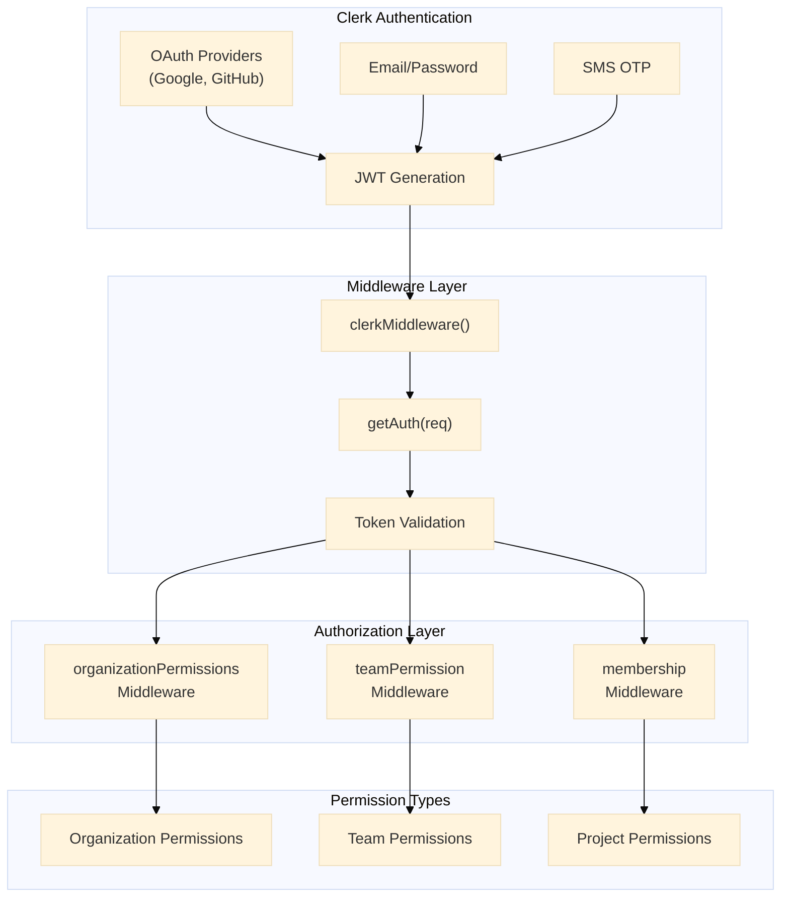
```mermaid
%%{init: {'theme': 'base'}}%%
flowchart TB
    subgraph CLERK_FLOW["Clerk Authentication"]
        C1["OAuth Providers<br/>(Google, GitHub)"]
        C2["Email/Password"]
        C3["SMS OTP"]
        C4["JWT Generation"]
    end

    subgraph MIDDLEWARE["Middleware Layer"]
        M1["clerkMiddleware()"]
        M2["getAuth(req)"]
        M3["Token Validation"]
    end

    subgraph RBAC["Authorization Layer"]
        R1["organizationPermissions<br/>Middleware"]
        R2["teamPermission<br/>Middleware"]
        R3["membership<br/>Middleware"]
    end

    subgraph PERMISSIONS["Permission Types"]
        P1["Organization Permissions"]
        P2["Team Permissions"]
        P3["Project Permissions"]
    end

    C1 & C2 & C3 --> C4
    C4 --> M1
    M1 --> M2
    M2 --> M3
    M3 --> R1 & R2 & R3
    R1 --> P1
    R2 --> P2
    R3 --> P3
```

### Permission Matrix

| Resource | Action | Required Permission |
|----------|--------|---------------------|
| Organization | Create | Authenticated user |
| Organization | Read | `org:read` or public |
| Organization | Update | `org:update` |
| Organization | Delete | `org:delete` + owner |
| Organization | Manage Members | `org:members:manage` |
| Team | Create | `org:teams:create` |
| Team | Read | `team:read` or visibility check |
| Team | Update | `team:update` |
| Team | Delete | `team:delete` |
| Team | Invite | `team:members:invite` |
| Project | Create | `team:projects:create` |
| Project | Read | `project:read` or visibility check |

---

## Event-Driven Architecture

### Inngest Function Catalog

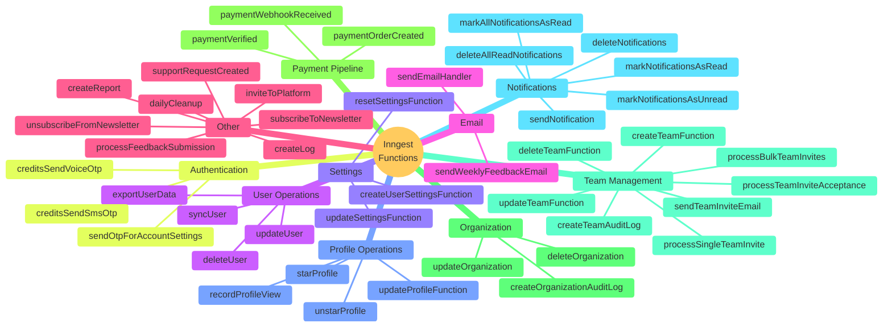
```mermaid
%%{init: {'theme': 'base'}}%%
mindmap
    root((Inngest<br/>Functions))
        User Operations
            syncUser
            updateUser
            deleteUser
            exportUserData
        Profile Operations
            updateProfileFunction
            recordProfileView
            starProfile
            unstarProfile
        Authentication
            sendOtpForAccountSettings
            creditsSendSmsOtp
            creditsSendVoiceOtp
        Payment Pipeline
            paymentOrderCreated
            paymentVerified
            paymentWebhookReceived
        Organization
            createOrganizationAuditLog
            updateOrganization
            deleteOrganization
        Team Management
            createTeamFunction
            updateTeamFunction
            deleteTeamFunction
            sendTeamInviteEmail
            processSingleTeamInvite
            processBulkTeamInvites
            processTeamInviteAcceptance
            createTeamAuditLog
        Notifications
            sendNotification
            markNotificationsAsRead
            markNotificationsAsUnread
            markAllNotificationsAsRead
            deleteNotifications
            deleteAllReadNotifications
        Settings
            createUserSettingsFunction
            updateSettingsFunction
            resetSettingsFunction
        Email
            sendEmailHandler
            sendWeeklyFeedbackEmail
        Other
            subscribeToNewsletter
            unsubscribeFromNewsletter
            inviteToPlatform
            createLog
            createReport
            dailyCleanup
            supportRequestCreated
            processFeedbackSubmission
```

### Event Flow: User Sign Up

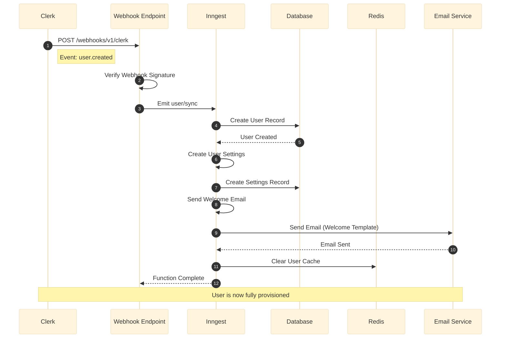
```mermaid
%%{init: {'theme': 'base'}}%%
sequenceDiagram
    autonumber
    participant C as Clerk
    participant W as Webhook Endpoint
    participant I as Inngest
    participant DB as Database
    participant R as Redis
    participant E as Email Service

    C->>W: POST /webhooks/v1/clerk
    Note right of C: Event: user.created
    W->>W: Verify Webhook Signature
    W->>I: Emit user/sync

    I->>DB: Create User Record
    DB-->>I: User Created

    I->>I: Create User Settings
    I->>DB: Create Settings Record

    I->>I: Send Welcome Email
    I->>E: Send Email (Welcome Template)
    E-->>I: Email Sent

    I->>R: Clear User Cache
    I-->>W: Function Complete

    Note over C,E: User is now fully provisioned
```

### Event Types Reference

| Event | Trigger | Handler Function | Side Effects |
|-------|---------|------------------|--------------|
| `user/sync` | Clerk webhook | `syncUser` | Create user, settings, welcome email |
| `user/update` | Profile update | `updateUser` | Update user record, invalidate cache |
| `user/delete` | Account deletion | `deleteUser` | Soft delete, export data, send email |
| `payment/order.created` | Order initiation | `paymentOrderCreated` | Log order creation |
| `payment/verified` | Payment verification | `paymentVerified` | Create credit transaction, send email |
| `payment/webhook.received` | Razorpay webhook | `paymentWebhookReceived` | Process webhook, handle failures/refunds |
| `notification/send` | Various triggers | `sendNotification` | Create notification, update counts |
| `profile/star` | User stars profile | `starProfile` | Create star record, send notification |
| `team/invite.send` | Team invite | `sendTeamInviteEmail` | Send invite email |

---

## Caching Strategy

### Redis Key Schema

```
├── user:credits:{userId}              # Current credit balance
├── user:credit:history:{userId}:{hash} # Paginated transaction history
├── user:unread:notifications:{userId} # Unread notification count
├── user:organizations:{userId}        # User's organization list
├── user:teams:{userId}                # User's team memberships
├── user:organization:context:{userId} # Active org context
├── user:team:context:{userId}         # Active team context
├── profile:cache:{userId}             # Full profile data
├── profile:star:{profileId}           # Star count
├── settings:cache:{userId}            # User settings
├── otp:store:{identifier}             # OTP value (TTL: 5min)
├── otp:attempts:{identifier}          # Verification attempts
├── otp:lockout:{identifier}           # Lockout state
├── otp:send:attempts:{identifier}     # Send attempts
├── otp:send:lockout:{identifier}      # Send lockout state
├── ratelimit:{route}:{userId}         # API rate limit counters
├── feedback:ratelimit:{userId}        # Feedback submission limits
├── star:ratelimit:{userId}            # Star action limits
├── data:export:{userId}               # Export operation tracking
└── env:cache                          # Environment variables cache
```

### Cache TTL Settings

| Cache Type | TTL | Invalidation Trigger |
|------------|-----|---------------------|
| User Credits | 5 minutes | Credit transaction create |
| Credit History | 5 minutes | Credit transaction create |
| Profile | 1 hour | Profile update |
| Settings | 24 hours | Settings update |
| Notifications Count | 30 seconds | Notification create/read |
| Organizations | 5 minutes | Membership change |
| Teams | 5 minutes | Membership change |
| OTP | 5 minutes | OTP verification |
| Rate Limit | 1-30 minutes | Auto-reset |
| Environment | 24 hours | Manual refresh |

### Cache Invalidation Flow

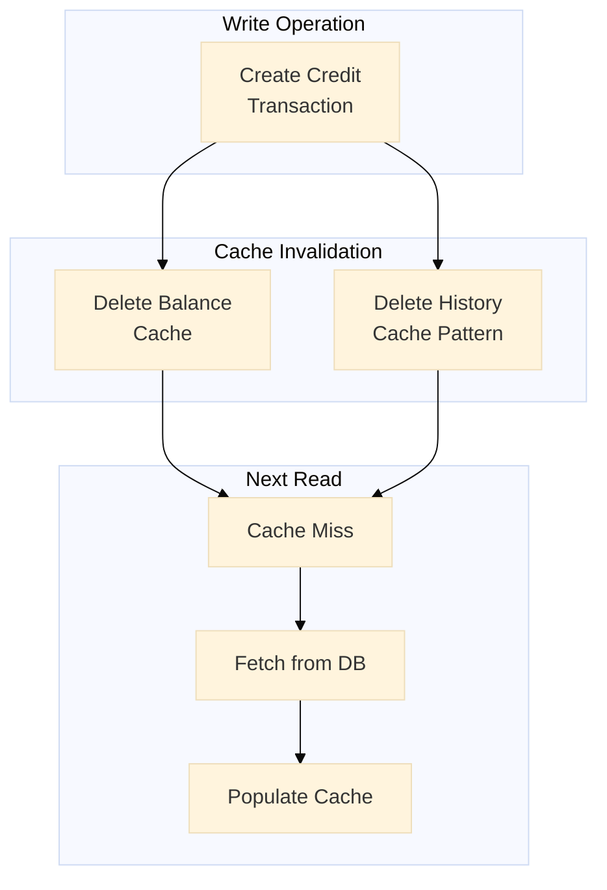
```mermaid
%%{init: {'theme': 'base'}}%%
flowchart TB
    subgraph WRITE["Write Operation"]
        A["Create Credit<br/>Transaction"]
    end

    subgraph INVALIDATE["Cache Invalidation"]
        B["Delete Balance<br/>Cache"]
        C["Delete History<br/>Cache Pattern"]
    end

    subgraph NEXT_READ["Next Read"]
        D["Cache Miss"]
        E["Fetch from DB"]
        F["Populate Cache"]
    end

    A --> B
    A --> C
    B --> D
    C --> D
    D --> E
    E --> F
```

---

## Payment Processing

### Razorpay Integration

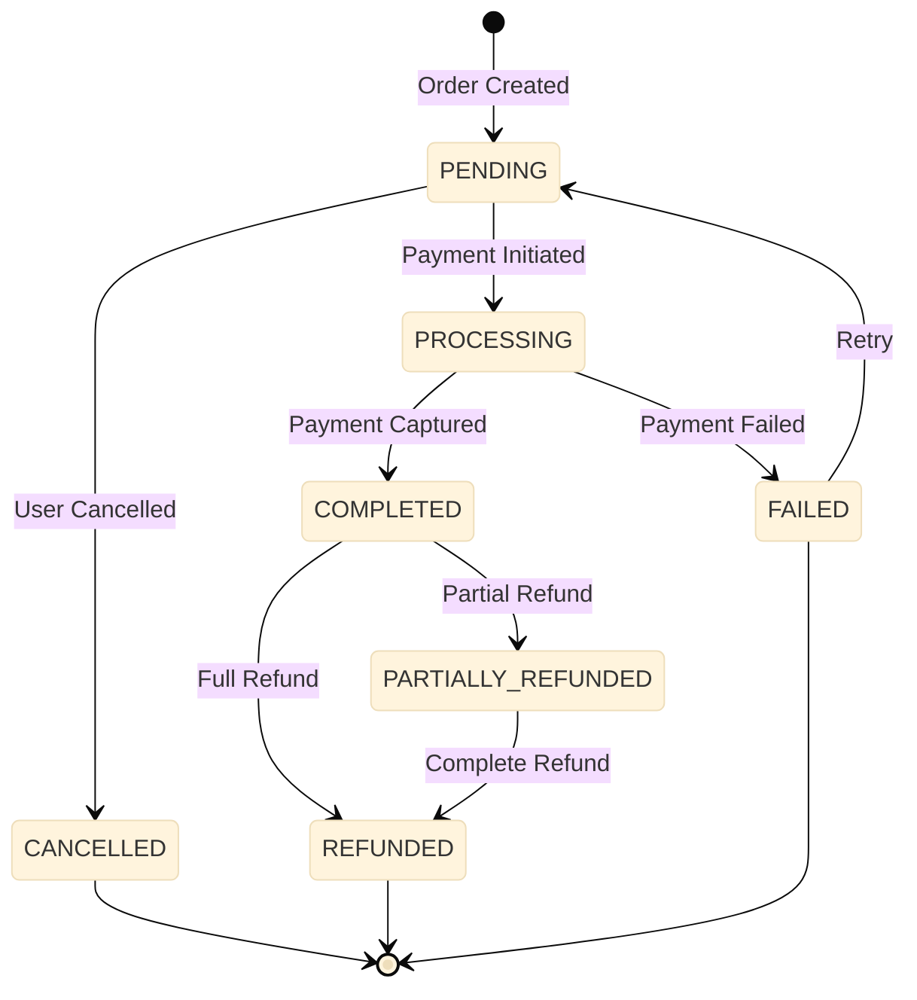
```mermaid
%%{init: {'theme': 'base'}}%%
stateDiagram-v2
    [*] --> PENDING: Order Created
    PENDING --> PROCESSING: Payment Initiated
    PROCESSING --> COMPLETED: Payment Captured
    PROCESSING --> FAILED: Payment Failed
    COMPLETED --> REFUNDED: Full Refund
    COMPLETED --> PARTIALLY_REFUNDED: Partial Refund
    FAILED --> PENDING: Retry
    PENDING --> CANCELLED: User Cancelled
    CANCELLED --> [*]
    REFUNDED --> [*]
    PARTIALLY_REFUNDED --> REFUNDED: Complete Refund
    FAILED --> [*]
```

### Webhook Processing

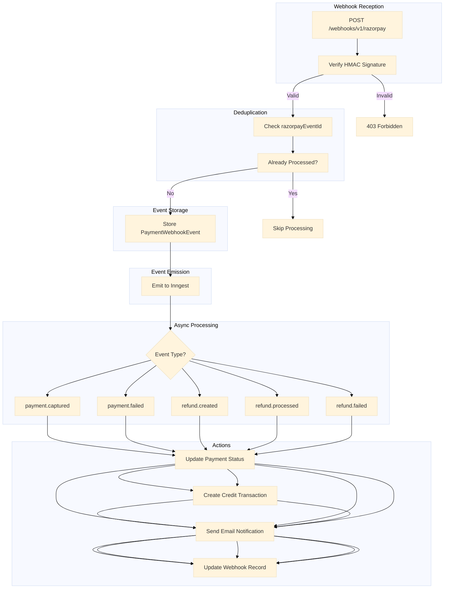
```mermaid
%%{init: {'theme': 'base'}}%%
flowchart TB
    subgraph RECEIVE["Webhook Reception"]
        A["POST /webhooks/v1/razorpay"]
        B["Verify HMAC Signature"]
    end

    subgraph DEDUPE["Deduplication"]
        C["Check razorpayEventId"]
        D["Already Processed?"]
    end

    subgraph STORE["Event Storage"]
        E["Store PaymentWebhookEvent"]
    end

    subgraph EMIT["Event Emission"]
        F["Emit to Inngest"]
    end

    subgraph PROCESS["Async Processing"]
        G{"Event Type?"}
        H["payment.captured"]
        I["payment.failed"]
        J["refund.created"]
        K["refund.processed"]
        L["refund.failed"]
    end

    subgraph ACTIONS["Actions"]
        M["Update Payment Status"]
        N["Create Credit Transaction"]
        O["Send Email Notification"]
        P["Update Webhook Record"]
    end

    A --> B
    B -->|Valid| C
    B -->|Invalid| REJECT["403 Forbidden"]
    C --> D
    D -->|Yes| SKIP["Skip Processing"]
    D -->|No| E
    E --> F
    F --> G
    G --> H & I & J & K & L
    H --> M --> N --> O --> P
    I --> M --> O --> P
    J --> M --> O --> P
    K --> M --> N --> O --> P
    L --> M --> O --> P
```

### Credit Plans

| Plan ID | Name | Price (INR) | Credits | Features |
|---------|------|-------------|---------|----------|
| `plan_starter` | Starter | ₹99 | 100 | Basic features |
| `plan_pro` | Pro | ₹499 | 600 | +20% bonus credits |
| `plan_enterprise` | Enterprise | ₹1,999 | 3000 | +50% bonus, priority support |

---

## AI Integration

### AI Assistant Architecture

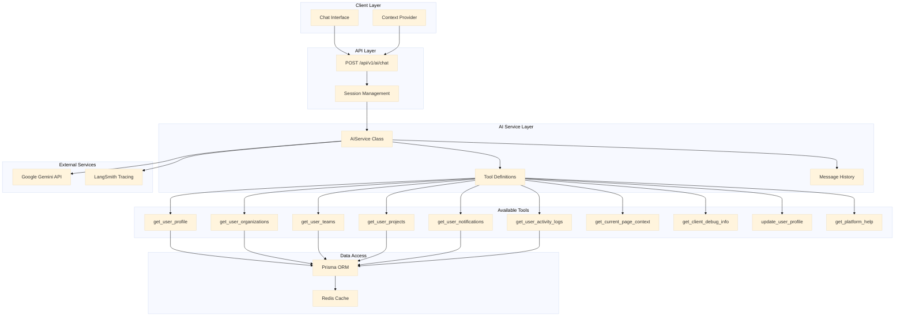
```mermaid
%%{init: {'theme': 'base'}}%%
flowchart TB
    subgraph CLIENT["Client Layer"]
        A["Chat Interface"]
        B["Context Provider"]
    end

    subgraph API["API Layer"]
        C["POST /api/v1/ai/chat"]
        D["Session Management"]
    end

    subgraph SERVICE["AI Service Layer"]
        E["AIService Class"]
        F["Tool Definitions"]
        G["Message History"]
    end

    subgraph TOOLS["Available Tools"]
        T1["get_user_profile"]
        T2["get_user_organizations"]
        T3["get_user_teams"]
        T4["get_user_projects"]
        T5["get_user_notifications"]
        T6["get_user_activity_logs"]
        T7["get_current_page_context"]
        T8["get_client_debug_info"]
        T9["update_user_profile"]
        T10["get_platform_help"]
    end

    subgraph EXTERNAL["External Services"]
        H["Google Gemini API"]
        I["LangSmith Tracing"]
    end

    subgraph DATA["Data Access"]
        J["Prisma ORM"]
        K["Redis Cache"]
    end

    A --> C
    B --> C
    C --> D
    D --> E
    E --> F
    E --> G
    F --> T1 & T2 & T3 & T4 & T5 & T6 & T7 & T8 & T9 & T10
    E --> H
    E --> I
    T1 & T2 & T3 & T4 & T5 & T6 --> J
    J --> K
```

### AI Tool Permissions

| Tool | Read | Write | Auth Required | Rate Limited |
|------|------|-------|---------------|--------------|
| get_user_profile | ✅ | ❌ | ✅ | ❌ |
| get_user_organizations | ✅ | ❌ | ✅ | ❌ |
| get_user_teams | ✅ | ❌ | ✅ | ❌ |
| get_user_projects | ✅ | ❌ | ✅ | ❌ |
| get_user_notifications | ✅ | ❌ | ✅ | ❌ |
| get_user_activity_logs | ✅ | ❌ | ✅ | ❌ |
| update_user_profile | ❌ | ✅ | ✅ | ✅ |
| get_platform_help | ✅ | ❌ | ❌ | ❌ |

---

## Observability & Monitoring

### Telemetry Stack

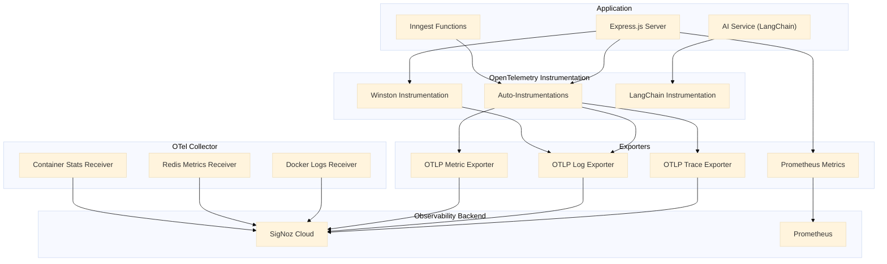
```mermaid
%%{init: {'theme': 'base'}}%%
flowchart TB
    subgraph APP["Application"]
        A["Express.js Server"]
        B["Inngest Functions"]
        C["AI Service (LangChain)"]
    end

    subgraph INSTRUMENTATION["OpenTelemetry Instrumentation"]
        D["Auto-Instrumentations"]
        E["Winston Instrumentation"]
        F["LangChain Instrumentation"]
    end

    subgraph EXPORT["Exporters"]
        G["OTLP Trace Exporter"]
        H["OTLP Log Exporter"]
        I["OTLP Metric Exporter"]
        J["Prometheus Metrics"]
    end

    subgraph COLLECTOR["OTel Collector"]
        K["Docker Logs Receiver"]
        L["Redis Metrics Receiver"]
        M["Container Stats Receiver"]
    end

    subgraph BACKEND["Observability Backend"]
        N["SigNoz Cloud"]
        O["Prometheus"]
    end

    A --> D
    B --> D
    C --> F
    D --> G & H & I
    A --> E --> H
    A --> J
    G & H & I --> N
    J --> O
    K & L & M --> N
```

### Metrics Exposed

| Metric | Type | Labels | Description |
|--------|------|--------|-------------|
| `http_request_duration_seconds` | Histogram | method, route, status | Request latency |
| `http_requests_total` | Counter | method, route, status | Total requests |
| `nodejs_active_handles` | Gauge | - | Active handles |
| `nodejs_heap_size_used_bytes` | Gauge | - | Heap memory usage |
| `prisma_pool_connections_active` | Gauge | - | Active DB connections |
| `redis_commands_total` | Counter | command | Redis command count |
| `inngest_function_runs_total` | Counter | function, status | Function executions |

### Log Correlation

```json
{
  "level": "info",
  "message": "Payment verified successfully",
  "timestamp": "2025-12-30T17:25:00.000Z",
  "service": "fairarena-backend",
  "trace_id": "abc123def456...",
  "span_id": "789ghi...",
  "userId": "user_xyz",
  "paymentId": "pay_123",
  "amount": 499,
  "credits": 600
}
```

---

## Security Architecture

### Defense-in-Depth Layers

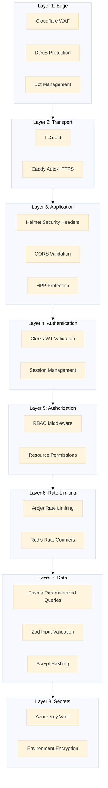
```mermaid
%%{init: {'theme': 'base'}}%%
flowchart TB
    subgraph L1["Layer 1: Edge"]
        A["Cloudflare WAF"]
        B["DDoS Protection"]
        C["Bot Management"]
    end

    subgraph L2["Layer 2: Transport"]
        D["TLS 1.3"]
        E["Caddy Auto-HTTPS"]
    end

    subgraph L3["Layer 3: Application"]
        F["Helmet Security Headers"]
        G["CORS Validation"]
        H["HPP Protection"]
    end

    subgraph L4["Layer 4: Authentication"]
        I["Clerk JWT Validation"]
        J["Session Management"]
    end

    subgraph L5["Layer 5: Authorization"]
        K["RBAC Middleware"]
        L["Resource Permissions"]
    end

    subgraph L6["Layer 6: Rate Limiting"]
        M["Arcjet Rate Limiting"]
        N["Redis Rate Counters"]
    end

    subgraph L7["Layer 7: Data"]
        O["Prisma Parameterized Queries"]
        P["Zod Input Validation"]
        Q["Bcrypt Hashing"]
    end

    subgraph L8["Layer 8: Secrets"]
        R["Azure Key Vault"]
        S["Environment Encryption"]
    end

    L1 --> L2 --> L3 --> L4 --> L5 --> L6 --> L7 --> L8
```

### Security Headers

```http
Content-Security-Policy: default-src 'self'; img-src 'self' data: https: blob:; script-src 'self' 'unsafe-inline'; style-src 'self' 'unsafe-inline'; font-src 'self' data:
X-Content-Type-Options: nosniff
X-Frame-Options: DENY
X-XSS-Protection: 1; mode=block
Referrer-Policy: strict-origin-when-cross-origin
Permissions-Policy: camera=(), microphone=(), geolocation=()
```

### Sensitive Data Handling

| Data Type | Storage | Encryption | Access Control |
|-----------|---------|------------|----------------|
| Passwords | Not stored (Clerk) | N/A | Clerk managed |
| JWT Tokens | Memory only | RSA signature | Short TTL |
| OTP Codes | Redis | Bcrypt hash | 5-minute TTL |
| Phone Numbers | PostgreSQL | AES-256 (Key Vault) | Auth required |
| Payment IDs | PostgreSQL | N/A | Auth required |
| API Keys | Azure Key Vault | HSM | Managed Identity |

---

## Deployment Architecture

### Container Orchestration

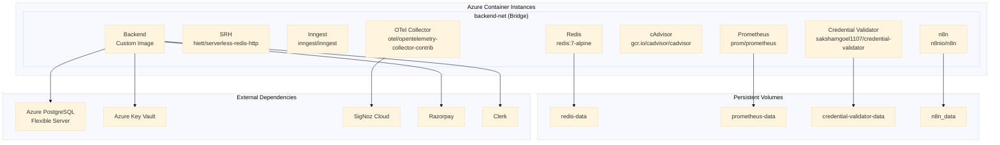
```mermaid
%%{init: {'theme': 'base'}}%%
flowchart TB
    subgraph HOST["Azure Container Instances"]
        subgraph NETWORK["backend-net (Bridge)"]
            R["Redis<br/>redis:7-alpine"]
            S["SRH<br/>hiett/serverless-redis-http"]
            I["Inngest<br/>inngest/inngest"]
            B["Backend<br/>Custom Image"]
            P["Prometheus<br/>prom/prometheus"]
            C["cAdvisor<br/>gcr.io/cadvisor/cadvisor"]
            O["OTel Collector<br/>otel/opentelemetry-collector-contrib"]
            CV["Credential Validator<br/>sakshamgoel1107/credential-validator"]
            N8N["n8n<br/>n8nio/n8n"]
        end
    end

    subgraph VOLUMES["Persistent Volumes"]
        V1["redis-data"]
        V2["prometheus-data"]
        V3["credential-validator-data"]
        V4["n8n_data"]
    end

    subgraph EXTERNAL["External Dependencies"]
        PG["Azure PostgreSQL<br/>Flexible Server"]
        KV["Azure Key Vault"]
        SN["SigNoz Cloud"]
        RP["Razorpay"]
        CL["Clerk"]
    end

    R --> V1
    P --> V2
    CV --> V3
    N8N --> V4

    B --> PG
    B --> KV
    O --> SN
    B --> RP
    B --> CL
```

### Health Check Cascade

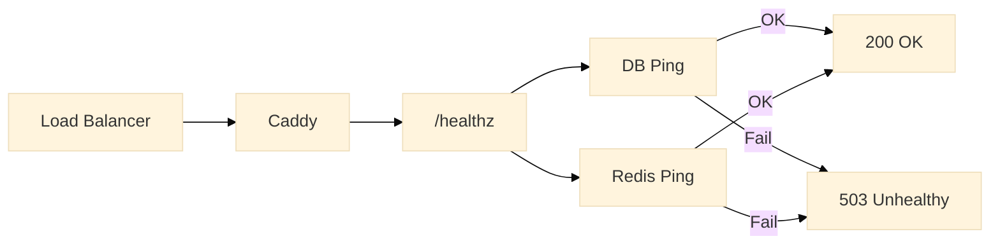
```mermaid
%%{init: {'theme': 'base'}}%%
flowchart LR
    LB["Load Balancer"] --> CADDY["Caddy"]
    CADDY --> BACKEND["/healthz"]
    BACKEND --> DB_CHECK["DB Ping"]
    BACKEND --> REDIS_CHECK["Redis Ping"]
    DB_CHECK -->|OK| HEALTHY["200 OK"]
    REDIS_CHECK -->|OK| HEALTHY
    DB_CHECK -->|Fail| UNHEALTHY["503 Unhealthy"]
    REDIS_CHECK -->|Fail| UNHEALTHY
```

---

## Disaster Recovery & Failover

### Database Failover

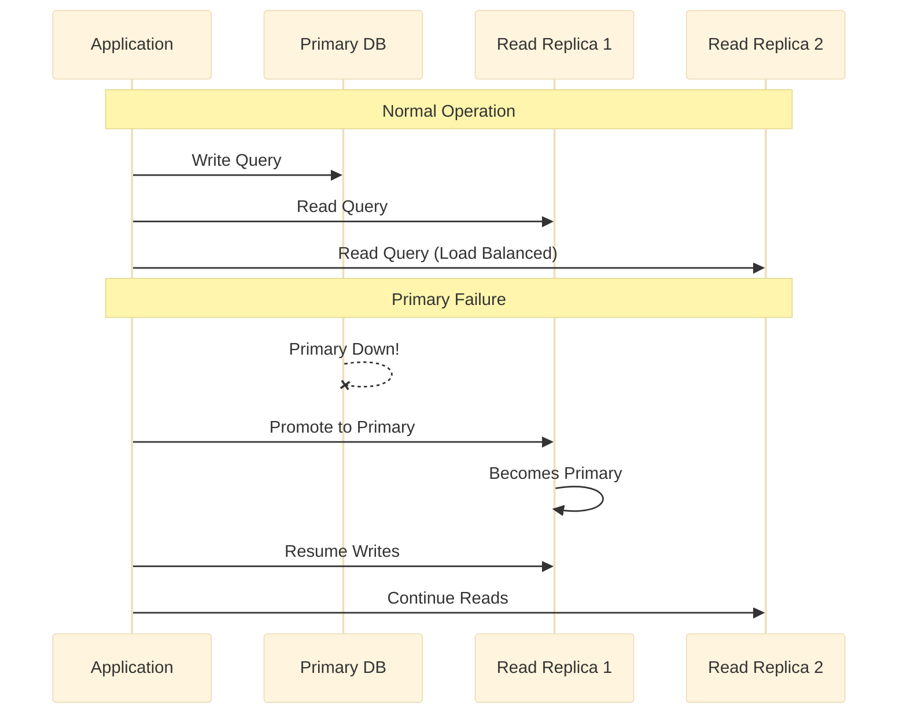
```mermaid
%%{init: {'theme': 'base'}}%%
sequenceDiagram
    participant A as Application
    participant P as Primary DB
    participant R1 as Read Replica 1
    participant R2 as Read Replica 2

    Note over A,R2: Normal Operation
    A->>P: Write Query
    A->>R1: Read Query
    A->>R2: Read Query (Load Balanced)

    Note over A,R2: Primary Failure
    P--xP: Primary Down!
    A->>R1: Promote to Primary
    R1->>R1: Becomes Primary
    A->>R1: Resume Writes
    A->>R2: Continue Reads
```

### Backup Strategy

| Component | Backup Type | Frequency | Retention | RTO | RPO |
|-----------|-------------|-----------|-----------|-----|-----|
| PostgreSQL | Continuous (WAL) | Streaming | 35 days | 5 min | 0 min |
| PostgreSQL | Full Snapshot | Daily | 30 days | 30 min | 24 hrs |
| Redis | RDB Snapshot | Every 1 min | 24 hrs | 2 min | 1 min |
| Redis | AOF | Continuous | 24 hrs | 1 min | 0 min |
| Secrets | Key Vault | Versioned | 90 days | Instant | 0 |

---

## Performance Benchmarks

### Latency Targets (P99)

| Endpoint Category | Target | Actual | Status |
|-------------------|--------|--------|--------|
| Health Check | <50ms | 15ms | ✅ |
| Cached Reads | <100ms | 45ms | ✅ |
| Database Reads | <200ms | 120ms | ✅ |
| Database Writes | <500ms | 280ms | ✅ |
| Payment Create | <2s | 1.2s | ✅ |
| AI Chat | <5s | 3.5s | ✅ |
| File Export | <30s | 18s | ✅ |

### Throughput Capacity

| Resource | Capacity | Limit Type |
|----------|----------|------------|
| API Requests | 1000 req/min | Arcjet Rate Limit |
| Webhook Events | 100 req/min | Per-endpoint |
| Database Connections | 50 active | Pool size |
| Redis Operations | 10,000 ops/s | SRH proxy |
| Inngest Events | 500/min | Concurrency limit |

### Resource Utilization Targets

| Resource | Target | Alert Threshold |
|----------|--------|-----------------|
| CPU | <70% | >85% |
| Memory | <80% | >90% |
| DB Connections | <60% pool | >80% pool |
| Redis Memory | <70% | >85% |
| Disk I/O | <50% | >75% |

---

## Appendix A: Environment Variables

### Required Variables

| Variable | Description | Source |
|----------|-------------|--------|
| `DATABASE_URL` | Primary PostgreSQL connection | Key Vault |
| `DATABASE_URL_READ_ONLY_1` | Read replica 1 | Key Vault |
| `DATABASE_URL_READ_ONLY_2` | Read replica 2 | Key Vault |
| `CLERK_SECRET_KEY` | Clerk API secret | Key Vault |
| `CLERK_WEBHOOK_SECRET` | Webhook signature key | Key Vault |
| `INNGEST_SIGNING_KEY` | Inngest auth | .env.inngest |
| `INNGEST_EVENT_KEY` | Inngest events | .env.inngest |
| `RESEND_API_KEY` | Email service | Key Vault |
| `RAZORPAY_KEY_ID` | Payment gateway | Key Vault |
| `RAZORPAY_KEY_SECRET` | Payment secret | Key Vault |
| `RAZORPAY_WEBHOOK_SECRET` | Webhook verification | Key Vault |
| `GOOGLE_GEMINI_API_KEY` | AI service | Key Vault |
| `UPSTASH_REDIS_REST_URL` | Redis endpoint | .env |
| `UPSTASH_REDIS_REST_TOKEN` | Redis auth | .env |

### Optional Variables

| Variable | Default | Description |
|----------|---------|-------------|
| `PORT` | 3000 | Server port |
| `NODE_ENV` | development | Environment |
| `CORS_URL` | localhost:5173 | Allowed origins |
| `MAINTENANCE_MODE` | false | Enable maintenance |
| `PAYMENTS_ENABLED` | false | Enable payments |

---

## Appendix B: Error Codes

| Code | HTTP Status | Description |
|------|-------------|-------------|
| `AUTH_REQUIRED` | 401 | Authentication required |
| `FORBIDDEN` | 403 | Insufficient permissions |
| `NOT_FOUND` | 404 | Resource not found |
| `VALIDATION_ERROR` | 400 | Input validation failed |
| `RATE_LIMITED` | 429 | Too many requests |
| `PAYMENT_FAILED` | 402 | Payment processing failed |
| `INSUFFICIENT_CREDITS` | 402 | Not enough credits |
| `DUPLICATE_REQUEST` | 409 | Idempotency violation |
| `MAINTENANCE` | 503 | System maintenance |
| `INTERNAL_ERROR` | 500 | Unexpected error |

---

## Appendix C: API Versioning

| Version | Status | Deprecation | EOL |
|---------|--------|-------------|-----|
| v1 | Current | - | - |
| v2 | Planning | - | - |

### Breaking Change Policy

1. All breaking changes require major version bump
2. Minimum 6-month deprecation notice
3. Documentation of migration path
4. Parallel support during transition

---

## Document History

| Version | Date | Author | Changes |
|---------|------|--------|---------|
| 1.0.0 | 2025-12-30 | Engineering Team | Initial release |

---

*This document is auto-generated from source code analysis and should be updated whenever significant architectural changes are made.*
