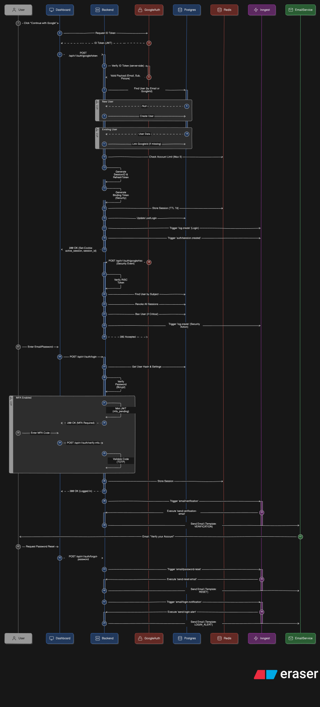
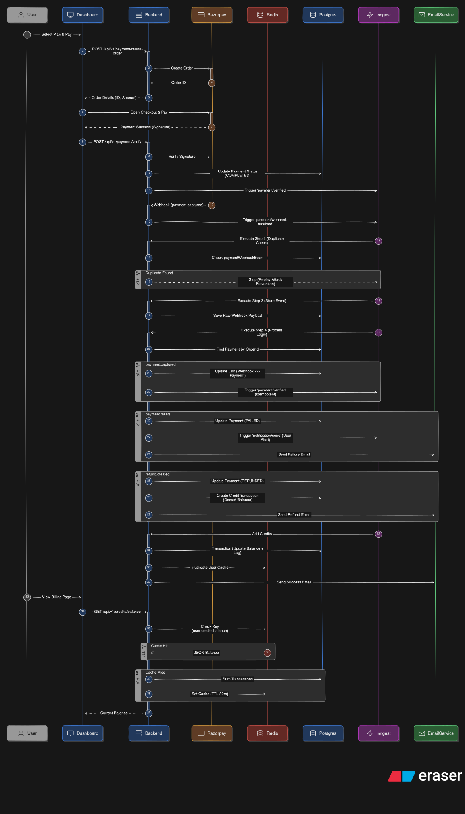
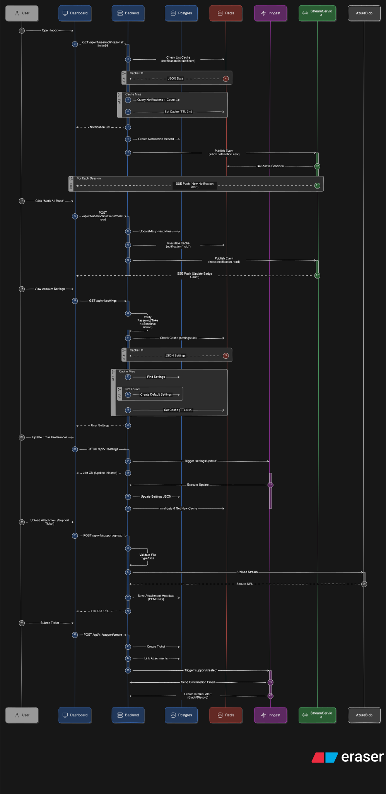

# System Architecture

This directory contains the editable source code for the system architecture diagrams.
We use [Eraser.io](https://eraser.io) for diagramming.

## Files

| Diagram                      | Source                                                                                       | Rendered                                                            |
| ---------------------------- | -------------------------------------------------------------------------------------------- | ------------------------------------------------------------------- |
| **Database Schema**          | [`database-schema.eraserdiagram`](./database-schema.eraserdiagram)                           |                            |
| **System Infrastructure**    | [`system-infrastructure.eraserdiagram`](./system-infrastructure.eraserdiagram)               |                       |
| **Auth System Flow**         | [`auth-system-flow.eraserdiagram`](./auth-system-flow.eraserdiagram)                         |                          |
| **Razorpay Credits System**  | [`razorpay-credits-system-flow.eraserdiagram`](./razorpay-credits-system-flow.eraserdiagram) |  |
| **Organization Permissions** | [`organization-permission-flow.eraserdiagram`](./organization-permission-flow.eraserdiagram) |               |
| **Inbox & Settings**         | [`inbox-settings-system-flow.eraserdiagram`](./inbox-settings-system-flow.eraserdiagram)     |                  |

## How to edit diagrams

1. **Copy Source**: Open the `.eraserdiagram` file and copy the code.
2. **Edit in Eraser**: Paste the code into a new [Eraser.io](https://eraser.io) file.
3. **Export SVG**: Once updated, export the diagram as an **SVG**.
4. **Update File**: Overwrite the corresponding `.svg` file in this directory.
5. **Update Source**: Copy the updated DSL code from Eraser back into the `.eraserdiagram` file.
6. **Commit Both**: Commit **BOTH** the `.eraserdiagram` and the `.svg` files in your PR.

> **Critical**: PRs that update the SVG without updating the specific source code (or vice versa) must be rejected. The source and the visual must always stay in sync.
